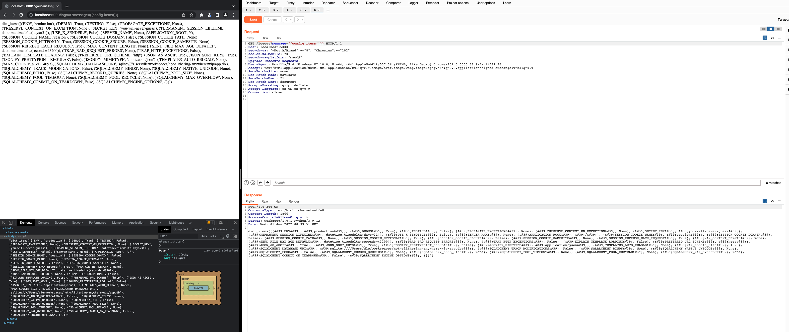

<!--- 
python3 -m flask run
pip3 --no-cache-dir install -r requirements.txt
python3 wip/app.py

sudo rm -rf ~/.venv/dle
rm -d -r "$(pip cache dir)"
rm -d -r "$(pip3 cache dir)"
python3 -m venv ~/.venv/wip
source ~/.venv/wip/bin/activate
pip3 --no-cache-dir install -r requirements.txt 
-->

## Testing for CORS
1. Run CORScanner https://github.com/chenjj/CORScanner
2. Change Origin to random value / True

## Vulnerable Packages
flask-cors@3.0.8 <br/>
Jinja2@2.11.2

###[Directory Traversal]
```flask-cors@3.0.8 --> flask-cors@3.0.9```  <br/>
https://cwe.mitre.org/data/definitions/22.html <br/>
https://cve.mitre.org/cgi-bin/cvename.cgi?name=CVE-2020-25032 <br/>
https://security.snyk.io/vuln/SNYK-PYTHON-FLASKCORS-608972 <br/>

### [Regular Expression Denial of Service (ReDoS)]
```Jinja2@2.11.2 --> jinja2@2.11.3```  <br/>
https://cwe.mitre.org/data/definitions/400.html <br/>
https://cve.mitre.org/cgi-bin/cvename.cgi?name=CVE-2020-28493 <br/>
https://security.snyk.io/vuln/SNYK-PYTHON-JINJA2-1012994 <br/>


## Routes.py, Line 263
Methodology </br>
https://book.hacktricks.xyz/pentesting-web/ssti-server-side-template-injection </br>
https://medium.com/@nyomanpradipta120/ssti-in-flask-jinja2-20b068fdaeee </br>
https://semgrep.dev/docs/cheat-sheets/flask-xss/ </br>

1. ``` http://localhost:5000/logout?message=%22${7*7}%22``` no <br/>
2. ``` http://localhost:5000/logout?message=%22{{7*7}}%22 ``` yes </br>
   3. ```http://localhost:5000/logout?message={{settings.SECRET_KEY}}```
    4.  SECRET KEY ```rbxJidmoslLOfOCCpf6k``` (BURPSUITE)
    


Fix 


## XSS
semgrep --config p/minusworld.flask-xss
